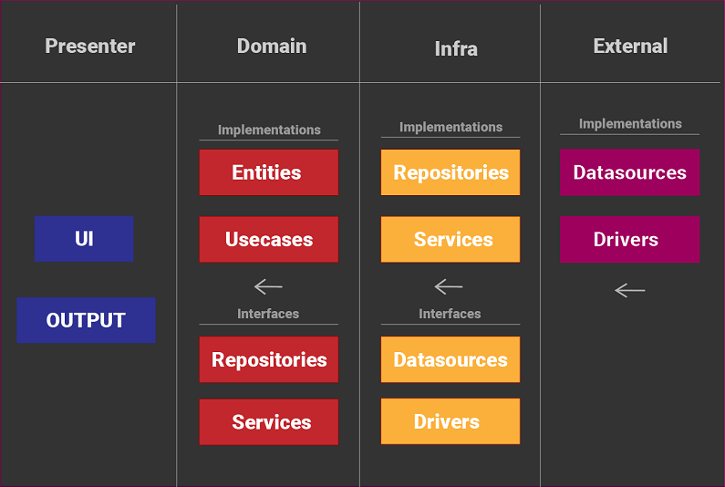
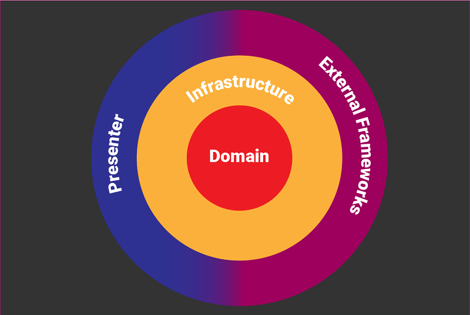

# Semana do Flutter | Clean Architecture

## #1 - Primeiro a Arquitetura

Repositório com proposta de arquitetura limpa para o Dart/Flutter: [Clean Dart](https://github.com/Flutterando/Clean-Dart)

## Clean Dart

 
## Presenter

- A Camada Presenter fica responsável por declarar as entradas, saídas e interações da aplicação.
- Usando o Flutter como exemplo, hospedaremos os Widgets, Pages e também alguma Gerência de Estado.

## Domain

- A camada de Domain hospedará as regras de negócio corporativa (Entity) e da aplicação (Usecase).

- Nossas entidades devem ser objetos simples podendo conter regras de validação dos seus dados por meio de funções ou ValueObjects. **A Entidade não deve usar nenhum Objeto das outras camadas**.

- Os casos de uso devem executar a lógica necessária para resolver o problema. Se o caso de uso precisar de algum acesso externo, então esse acesso deve ser feito por meio de contratos de interfaces, que serão implementados em uma camada de mais baixo nível.

- A camada Domain deve ser responsável apenas pela execução da lógica de negócio, não deve haver implementações de outros objetos como: **Repositories** ou **Services** dentro do Domain.

- Tomando um Repository como exemplo, teremos que ter apenas o contrato de interfaces (Abstrações) e a responsabilidade de implementação desse objeto deverá ser repassado a outra camada mais baixa.

## Infrastructure (Infra)

- Está camada dá suporte a camada Domain implementando suas interfaces. Para isso, essa camada se propõem a adaptar os dados externos para que possa cumprir os contratos do domínio.

- Muito provavelmente nessa camada iremos implementar alguma interface de um **Repository** ou **Services** que pode ou não depender de dados externos como uma API ou acesso a algum ***Hardware*** como por exemplo ***Bluetooth***.

- Para que o **Repository** possa processar e adaptar os dados externos devemos criar contratos para esses serviços visando passar a responsabilidade de implementação para a camada mais baixa da nossa arquitetura.

- Como sugestão, iremos criar objetos de **Data Source** quando quisermos acessar um dado externo, uma BaaS como ***Firebase*** ou um Cache Local usando ***SQLite*** por exemplo. 

- Outra sugestão seria criar objetos denominados **Drivers** para interfacear a comunicação com algum **Hardware** do dispositivo.

- Os acessos externos como* **Data sources** e **Drivers** devem ser implementados por outra camada, ficando apenas os contratos de interface nesta camada de **Infra**.

## External

- Aqui começaremos a implementar os acessos externos e que dependem de um hardware, package ou acesso muito específico.

- Basicamente a camada External deve conter tudo aquilo que terá grandes chances de ser alterado sem que o programador possa intervir diretamente no projeto.

- No Flutter por exemplo, para cache local usamos o ***SharedPreferences***, mas talvez em alguma estágio do projeto a implementação do ***SharedPreferences*** não seja mais suficiente para a aplicação e deve ser substituída por outro package como ***Hive***, nesse ponto a única coisa que precisamos fazer é criar uma nova classe, implementando o Contrato esperado pela camada mais alta (***que seria a Infra***) e implementarmos a Lógica usando o Hive.

- Um outro exemplo prático seria pensar em um Login com Firebase Auth, porém outro produto deseja utilizar um outro provider de autenticação. Bastaria apenas implementar um data source baseado no outro provider e **“Inverter a Dependência”** substituindo a implementação do Firebase pela nova quando for necessário.

Os Data sources devem se preocupar apenas em “descobrir” os dados externos e enviar para a camada de Infra para serem tratados.

Da mesma forma os objetos **Drivers** devem apenas retornar as informações solicitadas sobre o Hardware do Device e não devem fazer tratamento fora ao que lhe foi solicitado no contrato.

## Dicas

### Pense por camada

Quando for desenvolver comece a pensar por camada, não devemos nos preocupar com o que tem na camada de **Presenter** ou **External** por exemplo. Se pensarmos nas camadas mais externas podemos acabar nos orientando (erroneamente) por essas camadas. Assim, devemos nos acostumar a desenvolver camada por camada, de dentro para fora e não ao contrário.

Talvez no começo da sua jornada "Limpa" algumas camadas possam parecer "sem utilidade", isso acontece quando nossa mente ainda não está Pensando em Camadas (ou porque sua Regra de Negócio é simples demais para isso).

### Teste de Unidade será sua nova UI

### Gaste mais tempo tratando erros

### Não caia na tentação de furar uma camada